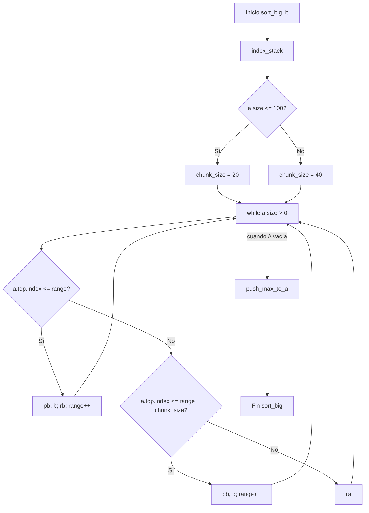
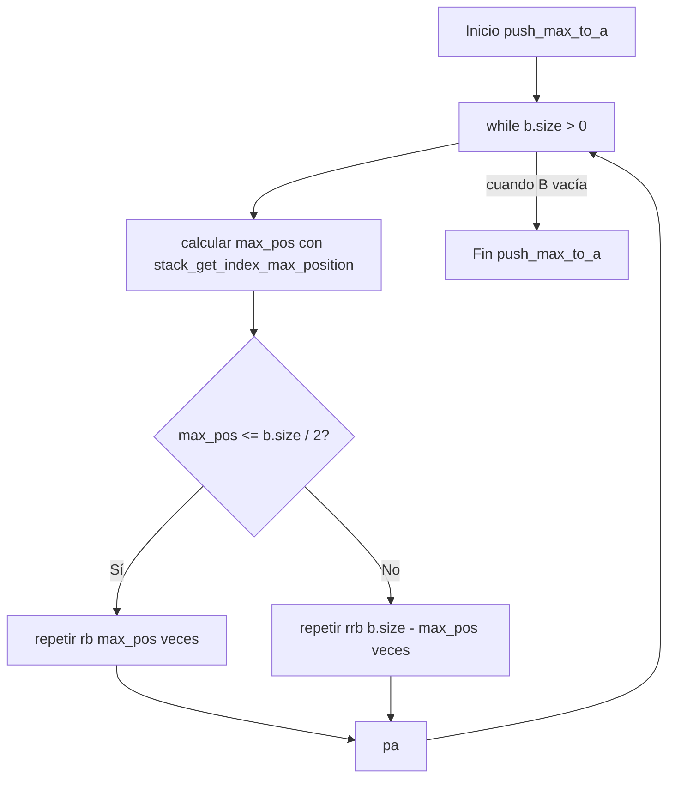

# Diagrama y traza de `sort_big` (push_swap)
## 1. Visión general del algoritmo
El algoritmo `sort_big` funciona en dos fases principales:

1. **Indexación** (fuera de esta traza, mediante `index_stack`):
   - Se copian los valores de la pila A a un array.
   - Se ordena el array.
   - A cada nodo de la pila se le asigna un `index` según su posición en el array ordenado.
2. **sort_big(a, b)**:
   - Usa `chunk_size` (20 si `size <= 100`, si no 40).º
   - Primera fase: mueve elementos de A a B en función de su índice y del rango actual.
   - Segunda fase: `push_max_to_a` mueve de B a A el máximo índice en cada iteración
     hasta dejar A ordenada de menor a mayor (de arriba a abajo).

### 1.1 Diagrama de flujo simplificado de `sort_big`


### 1.2 Diagrama de `push_max_to_a`


## 2. Indexación previa (`index_stack`)
Para la entrada de ejemplo `7 6 5 1 3 2 8 10`, los valores ordenados son:

- Array ordenado: `[1, 2, 3, 5, 6, 7, 8, 10]`
- Asignación de índices (`valor -> índice`):
  - 1 → 0
  - 2 → 1
  - 3 → 2
  - 5 → 3
  - 6 → 4
  - 7 → 5
  - 8 → 6
  - 10 → 7

Al construir la pila A desde los argumentos (top en el primer número),
tenemos al inicio:

- A (top → bottom): `(7,5), (6,4), (5,3), (1,0), (3,2), (2,1), (8,6), (10,7)`
- B vacía.

## 3. Traza paso a paso de `sort_big` para `7 6 5 1 3 2 8 10`
Convención en la traza:

- Cada pila se muestra como una lista de tuplas `(valor, índice)`.
- El primero de la lista es el **top** de la pila.
- `range` es el rango actual de índices que se pretende haber movido a B.

### 3.1 Pasos de ejecución
```text
Paso  1: start
  A (top -> bottom): [(7, 5), (6, 4), (5, 3), (1, 0), (3, 2), (2, 1), (8, 6), (10, 7)]
  B (top -> bottom): []
  range = 0

Paso  2: pb (a.top.index <= range + chunk_size)
  A (top -> bottom): [(6, 4), (5, 3), (1, 0), (3, 2), (2, 1), (8, 6), (10, 7)]
  B (top -> bottom): [(7, 5)]
  range = 1

Paso  3: pb (a.top.index <= range + chunk_size)
  A (top -> bottom): [(5, 3), (1, 0), (3, 2), (2, 1), (8, 6), (10, 7)]
  B (top -> bottom): [(6, 4), (7, 5)]
  range = 2

Paso  4: pb (a.top.index <= range + chunk_size)
  A (top -> bottom): [(1, 0), (3, 2), (2, 1), (8, 6), (10, 7)]
  B (top -> bottom): [(5, 3), (6, 4), (7, 5)]
  range = 3

Paso  5: pb + rb (a.top.index <= range)
  A (top -> bottom): [(3, 2), (2, 1), (8, 6), (10, 7)]
  B (top -> bottom): [(5, 3), (6, 4), (7, 5), (1, 0)]
  range = 4

Paso  6: pb + rb (a.top.index <= range)
  A (top -> bottom): [(2, 1), (8, 6), (10, 7)]
  B (top -> bottom): [(5, 3), (6, 4), (7, 5), (1, 0), (3, 2)]
  range = 5

Paso  7: pb + rb (a.top.index <= range)
  A (top -> bottom): [(8, 6), (10, 7)]
  B (top -> bottom): [(5, 3), (6, 4), (7, 5), (1, 0), (3, 2), (2, 1)]
  range = 6

Paso  8: pb + rb (a.top.index <= range)
  A (top -> bottom): [(10, 7)]
  B (top -> bottom): [(5, 3), (6, 4), (7, 5), (1, 0), (3, 2), (2, 1), (8, 6)]
  range = 7

Paso  9: pb + rb (a.top.index <= range)
  A (top -> bottom): []
  B (top -> bottom): [(5, 3), (6, 4), (7, 5), (1, 0), (3, 2), (2, 1), (8, 6), (10, 7)]
  range = 8

Paso 10: rrb (acercando máximo a la cima de B)
  A (top -> bottom): []
  B (top -> bottom): [(10, 7), (5, 3), (6, 4), (7, 5), (1, 0), (3, 2), (2, 1), (8, 6)]
  range = 8

Paso 11: pa (de B a A con el máximo actual)
  A (top -> bottom): [(10, 7)]
  B (top -> bottom): [(5, 3), (6, 4), (7, 5), (1, 0), (3, 2), (2, 1), (8, 6)]
  range = 8

Paso 12: rrb (acercando máximo a la cima de B)
  A (top -> bottom): [(10, 7)]
  B (top -> bottom): [(8, 6), (5, 3), (6, 4), (7, 5), (1, 0), (3, 2), (2, 1)]
  range = 8

Paso 13: pa (de B a A con el máximo actual)
  A (top -> bottom): [(8, 6), (10, 7)]
  B (top -> bottom): [(5, 3), (6, 4), (7, 5), (1, 0), (3, 2), (2, 1)]
  range = 8

Paso 14: rb (acercando máximo a la cima de B)
  A (top -> bottom): [(8, 6), (10, 7)]
  B (top -> bottom): [(6, 4), (7, 5), (1, 0), (3, 2), (2, 1), (5, 3)]
  range = 8

Paso 15: rb (acercando máximo a la cima de B)
  A (top -> bottom): [(8, 6), (10, 7)]
  B (top -> bottom): [(7, 5), (1, 0), (3, 2), (2, 1), (5, 3), (6, 4)]
  range = 8

Paso 16: pa (de B a A con el máximo actual)
  A (top -> bottom): [(7, 5), (8, 6), (10, 7)]
  B (top -> bottom): [(1, 0), (3, 2), (2, 1), (5, 3), (6, 4)]
  range = 8

Paso 17: rrb (acercando máximo a la cima de B)
  A (top -> bottom): [(7, 5), (8, 6), (10, 7)]
  B (top -> bottom): [(6, 4), (1, 0), (3, 2), (2, 1), (5, 3)]
  range = 8

Paso 18: pa (de B a A con el máximo actual)
  A (top -> bottom): [(6, 4), (7, 5), (8, 6), (10, 7)]
  B (top -> bottom): [(1, 0), (3, 2), (2, 1), (5, 3)]
  range = 8

Paso 19: rrb (acercando máximo a la cima de B)
  A (top -> bottom): [(6, 4), (7, 5), (8, 6), (10, 7)]
  B (top -> bottom): [(5, 3), (1, 0), (3, 2), (2, 1)]
  range = 8

Paso 20: pa (de B a A con el máximo actual)
  A (top -> bottom): [(5, 3), (6, 4), (7, 5), (8, 6), (10, 7)]
  B (top -> bottom): [(1, 0), (3, 2), (2, 1)]
  range = 8

Paso 21: rb (acercando máximo a la cima de B)
  A (top -> bottom): [(5, 3), (6, 4), (7, 5), (8, 6), (10, 7)]
  B (top -> bottom): [(3, 2), (2, 1), (1, 0)]
  range = 8

Paso 22: pa (de B a A con el máximo actual)
  A (top -> bottom): [(3, 2), (5, 3), (6, 4), (7, 5), (8, 6), (10, 7)]
  B (top -> bottom): [(2, 1), (1, 0)]
  range = 8

Paso 23: pa (de B a A con el máximo actual)
  A (top -> bottom): [(2, 1), (3, 2), (5, 3), (6, 4), (7, 5), (8, 6), (10, 7)]
  B (top -> bottom): [(1, 0)]
  range = 8

Paso 24: pa (de B a A con el máximo actual)
  A (top -> bottom): [(1, 0), (2, 1), (3, 2), (5, 3), (6, 4), (7, 5), (8, 6), (10, 7)]
  B (top -> bottom): []
  range = 8

```

Al finalizar el último paso, la pila A queda ordenada de menor a mayor:

- A (top -> bottom): `(1,0), (2,1), (3,2), (5,3), (6,4), (7,5), (8,6), (10,7)`
- B vacía.

Esto corresponde al array ordenado ascendentemente de los valores originales.
